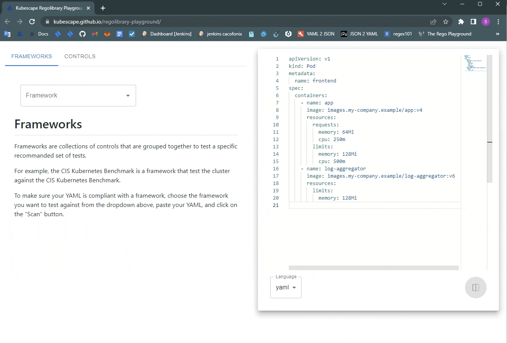

# React POC of [Kubescape Regolibrary](https://github.com/kubescape/regolibrary) playground
<p align="center">
<a href="https://kubescape.github.io/regolibrary-playground/">Playground</a>
<br/><br/>

<br/><br/>
</p>

## Updating
### k8s schemas
To update the k8s json schema, run the following command:
```
pip install openapi2jsonschema
openapi2jsonschema --stand-alone --kubernetes --strict https://raw.githubusercontent.com/kubernetes/kubernetes/master/api/openapi-spec/swagger.json
python scripts/k8s_schema.py schemas -o src/components/bin/k8s-schema.json
```

### Regolibrary
To update the regolibrary, download the latest version from [here](https://github.com/kubescape/regolibrary/releases/latest/download/kubescape_regolibrary_bundle_wasm.tar.gz) and copy it to `src/components/bin` folder.

## Deployment
To deploy the app, run the following command:
```
npm run deploy
```
For more information, see [this](https://create-react-app.dev/docs/deployment/#github-pages) page.

## TODO
### Must
- [ ] Clean the messy code
- [ ] Use tree-shaking to reduce the bundle size
- [ ] Complete the typescript migration, and fix all the errors / warnings
- [ ] Use material-ui Grid instead of Box with flex styling
- [ ] Make the editor component sticky instead of fixed
- [ ] Add a loading indicator to whole KubescapeRegolibraryComponent, instead of the current one (only text)

### Nice to have
- [ ] Add tests
- [ ] Improve the UI/UX
- [ ] Support custom controls inputs
- [ ] Investigate why somethims the eval button is not working
- [ ] Use custom monaco editor component and then:
    - [ ] Support yaml k8s json schema
    - [ ] Move default language to yaml
    - [ ] Enable ctrl-z by using the same monaco model for both editors (diff and regular)
    - [ ] Add instance scan on change and mark the errors in the editor
- [ ] Move the markdown generators for controls and frameworks to the regolibrary-utils
- [ ] Extract the regolibrary utils to a separate package
- [ ] Make the regolibrary eval function async (maybe using web workers)
- [ ] Add failed path support (currently only fix path is supported)
- [ ] Add three dots menu to the rego editor, with:
    - [ ] Download
    - [ ] Copy to clipboard
    - [ ] Format
    - [ ] Wrap lines
    - [ ] (only in diff mode) Toggle inline / side-by-side
- [ ] Support sharing by:
    - Start using Hash router (the only one supported by github pages)
    - Use the url params to store the state, including the yaml itself (as base64)
- [ ] Add tooltips
- [ ] Add dark mode?
- [ ] Add option to export the scan results to json?
- [ ] Change the language selector label to "Format"?

